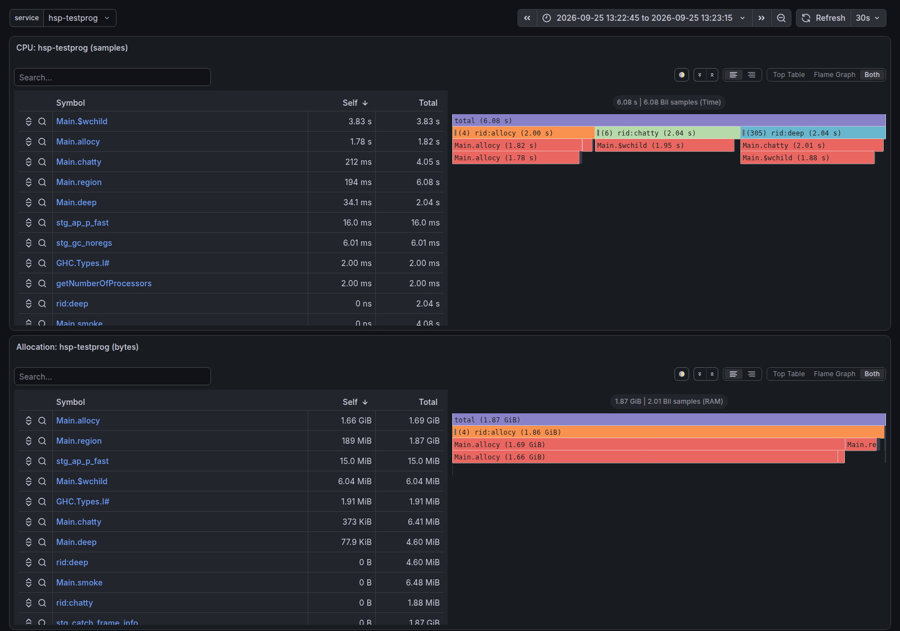
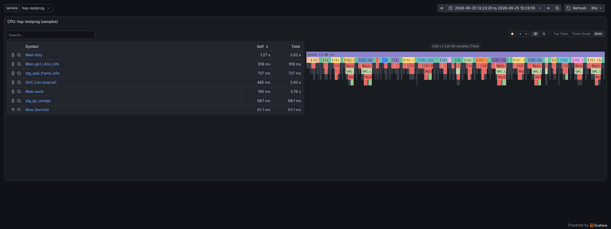

# hsp — continuous profiler for GHC programs

CPU and allocation per Haskell function, on real traffic, sampled from outside
the process with eBPF. The kernel side walks the GHC stack (the STG stack
pointer lives in `%rbp`, so `perf` cannot); `hsp` turns the samples into
names, flame graphs and continuous profiles in Pyroscope.

Nothing is injected into the target: no RTS patch, no `-prof` build. The
program runs the code it would run anyway; the profiler reads it.

## What it looks like

The test program (`tests/testprog`) in Grafana, through `hsp collect` and
Pyroscope. Its smoke mode runs three regions on labelled green threads, one
after another; with `--label-mode full` each label is a root:



`rid:allocy` owns nearly all the allocation, `rid:chatty` spends its CPU in
the `child` it calls, and `rid:deep` recurses 300 frames (the `(305)` is the
collapsed recursion) before doing the same work. Each panel alone:
[CPU](docs/images/cpu-flamegraph.png), [allocation](docs/images/alloc-flamegraph.png).

Its `requests` mode serves 24 "requests", each on a thread labelled
`rid:req-<n>` that forks a helper labelled `rid:req-<n>|fork:bg`. Each request
is a root, so one request's CPU or allocation is one click away:



([allocation per request](docs/images/requests-alloc.png)). The smoke test checks
that the bytes hsp attributes to each request match what the thread itself
counted (`getAllocationCounter`).

To reproduce these without root, replay the smoke test's captures into the
second UI stack:

```bash
nix run .#stack-alt           # in another terminal: Grafana :3301, collector :4051
mkdir -p ~/.local/share/hsp-stack-alt/maps
cp tests/smoke/build/ghc984/testprog.hsm ~/.local/share/hsp-stack-alt/maps/hsp-testprog.hsm
hsp agent --from-capture tests/smoke/build/ghc984/live/smoke/cap.bin \
  --exe tests/smoke/build/ghc984/hsp-testprog --collector http://127.0.0.1:4051 \
  --host demo --label-mode full
```

A replay's samples start one minute before the replay and keep their
spacing, so the data is at "now minus a minute". Two replays started less
than a capture's length apart overlap in time and show as one profile.

## Build

```bash
nix build            # ./result/bin/hsp
nix develop -c make  # ./build/hsp
nix run .#stack      # the UI: Pyroscope :4040, Grafana :3300, hsp collect :4041
```

Dependencies: libbpf, elfutils (libdw/libelf), libcurl; clang for the BPF
object; bpftool for the skeleton. Linux 5.8+ (CAP_BPF/CAP_PERFMON), x86-64.

## Use

```bash
# once per binary, on the build host: the name map, straight from the ELF
hsp symmap ./my-service my-service.hsm

# a one-off capture (root): 99 Hz per CPU by default, until the target exits or -t secs
sudo hsp record -F 99 -t 60 -o cap.bin -p $(pgrep -x my-service)
sudo hsp record -o cap.bin -- ./my-service args        # or spawn it

# the report and the flame-graph inputs
hsp fold cap.bin my-service.hsm OUTDIR > OUTDIR/agg.txt

# continuous: an agent per host (no map on the host), one collector per fleet
hsp collect --listen 0.0.0.0:4041 --maps /var/lib/hsp/maps --pyroscope http://pyroscope:4040
sudo hsp agent --name my-service --collector http://collector:4041 --interval 10
```

`fold` writes `collapsed.txt` (CPU samples), `collapsed-alloc.txt` (bytes
allocated) and, when the program labels its threads, `collapsed-labelled.txt`
/ `collapsed-alloc-labelled.txt` with the label as the root frame. They load
into speedscope.app, inferno-flamegraph or Pyroscope. `agg.txt` has the top
functions (inclusive/self), the walk statistics and a resolution audit that
ends in a PASS/FAIL gate (exit 3 on FAIL).

## What you need from the target binary

Nothing at runtime: the sampler reads the RTS's own structures
(`stg_TSO_info`, `StgTSO`, info tables), which every GHC binary has. What the
*build* of the binary decides is how good the names are:

| built with | what the profile shows |
|---|---|
| plain `-O2`, unstripped | exported and top-level functions exact; local bindings (`go`, `sat_…`, workers) named by the nearest preceding symbol, so `fold`'s `guess%` is high and the module is right far more often than the function |
| `-O2` + the flags below | every local binding and stack frame by its real name and source span; DWARF fixes the leaves |
| stripped | nothing: `hsp record` refuses it (no `stg_TSO_info`) |

### Build flags

GHC options, on every package whose code you want named:

```
-finfo-table-map -finfo-table-map-with-stack   # IPE: names + spans for closures and stack frames (9.8+; 9.2: -finfo-table-map only)
-fexpose-internal-symbols                       # ELF symbols for local bindings
-g1                                             # DWARF line table (instruction -> source line)
-fdistinct-constructor-tables                   # optional: allocation site per constructor use
```

and at link time: do not strip (`executable-stripping: False`, no `-s`) and
keep the IPE data in the binary (it lives in `.data`; a split debug output
cannot carry it). Runtime cost of all of the above: none; the binary grows
(IPE for every package of a large service is ~1 GB of `.data`).
Deliberately not `-fexpose-all-unfoldings`: it changes what GHC inlines,
i.e. the code being measured. `-fno-omit-yields` is not needed either (the
sampler uses no safepoints). With cabal, put the `ghc-options` in
`cabal.project` under `package *` so dependencies get them too.

Then, on the build host: `hsp symmap BIN BIN.hsm`.

### Thread labels (optional): per request, per job, per endpoint

hsp reads the green thread's label (`GHC.Conc.labelThread`) as text on every
sample. Without one, samples are per process (and per green thread by id),
which is a complete profile, just without that split. With one, the label
becomes the root of the stack (`--label-mode full`), or its part after the
first space does (`--label-mode tag`), so a profile can be sliced by
request, job or endpoint:

```haskell
import GHC.Conc (myThreadId, labelThread)

serve req = do
  t <- myThreadId
  labelThread t ("rid:" <> requestId req <> " " <> endpoint req)   -- "rid:<id> <tag>"
  ...                                                              -- restore the old label after
```

Threads forked while serving do not inherit the label; label them too if
their work should count. Labels are in the TSO from GHC 9.6 on: a 9.2
program is sampled without them.

## GHC versions

| GHC | sampler | names (IPE) | labels |
|---|---|---|---|
| 9.2 | yes (`alloc_limit` at its 9.2 offset) | read from the `_ipe` `InfoProvEnt` symbols; closures and stack frames (no `-with-stack` flag needed) | no (the TSO has no label field before 9.6) |
| 9.8 | yes | read from the static IPE nodes in the ELF | yes |
| 9.10 | yes (`StgTSO` gained a word) | from an eventlog: `hsp symmap BIN OUT --eventlog E` after one run with `+RTS -l` (the 9.10 node layout is not read yet) | yes |

The offsets are chosen by the loader from the GHC version string in the
binary; an unknown version gets 9.8's and a warning. Frame-type numbers are
the same across these versions.

## Continuous profiling

The agent runs on the host, as root or with `CAP_BPF CAP_PERFMON
CAP_SYS_PTRACE` (`dist/INSTALL.md`, `dist/systemd/`). Every interval it folds
the samples since the last one into distinct stacks of raw info pointers with
a count and the bytes the green threads allocated, and POSTs them to the
collector (`src/wire.h`). The host holds no map and resolves nothing. The
collector matches the map by executable path and size (`maps.tsv`, or
`<basename>.hsm`), names the stacks and pushes `<service>.cpu` (samples) and
`<service>.alloc_space` (bytes) to Pyroscope with `host` and `pid` labels.
When the collector is unreachable the agent spools to disk and retries.

Operability: `--metrics-file` writes Prometheus text every interval (for
node_exporter's textfile collector; the collector serves `GET /metrics`);
`--max-batch-mb` flushes early at the cap (default 64), `--spool-max-mb`
bounds the spool (default 256, oldest first), `-r` sizes the ring (default
8 MiB); a rising ring-drop count is warned about. `--host NAME` sets the
`host` label (default: the machine's hostname). Without root,
`hsp agent --from-capture cap.bin --exe BIN --collector URL` replays a
capture through the same path, with its first sample at one minute ago.

## UI stack

`nix run .#stack` starts, under process-compose through
[services-flake](https://github.com/juspay/services-flake): Pyroscope (:4040),
Grafana (:3300, the UI: nixpkgs' Pyroscope has no embedded frontend;
Grafana's Pyroscope data source gives flame graphs, diffs and label filters)
provisioned with the data source and the "hsp" dashboard (CPU and allocation
flame graphs per service, samples/s per host), and an `hsp collect` (:4041).
State lives in `~/.local/share/hsp-stack` (`HSP_STACK_DIR`); the collector's
maps in `HSP_MAPS` (default `$HSP_STACK_DIR/maps`). `nix run .#stack-alt` is a
second instance on :3301/:4050/:4051. Bound to 127.0.0.1 with anonymous
admin: local use. The module is `stack/stack.nix`; import it into an existing
services-flake project with your ports. For production, run Pyroscope and
Grafana however you run them and point `hsp collect --pyroscope` at it.

## The sampler, and what it costs

`bpf/hsp.bpf.c` runs on a cpu-clock perf event on every CPU. For a tick in
the target process it reads ip/bp/r13/r12; checks that r13 + rCurrentTSO
names an object whose header is `stg_TSO_info` (a live Haskell thread); reads
the thread's id, label and allocation counter; walks the STG stack from rbp
(`bpf/hswalk.h`: scan up to 64 words above Sp for the first return frame,
then frame by frame to STOP_FRAME, validating each, two kernel reads per
frame) and writes one binary record (120 bytes + 16 per frame) to a ring
buffer. Everything else happens in userspace, later.

Measured on a production-sized service (a 4 GB binary, stacks of median
depth 47): 11 µs per sample in the kernel, i.e. 0.55% of one busy CPU at
499 Hz and 0.1% at the 99 Hz default; the service's own per-request CPU,
allocation and latency were unchanged within run-to-run noise with the
sampler on at 499 Hz. Sampled CPU per request tracked the service's own
accounting at r = 0.98, allocation at r = 0.998.

Overhead levers, in order of effect: `-F` (samples per second per CPU), `-d`
(max frames, default 512), `--no-thunk` (skips naming update frames' thunks
by their creator: two reads per update frame), `--no-label` / `--no-alloc`.

## Building the map (`hsp symmap`)

Tiers, joined by address: the symbol table (what `nm --defined-only -S`
lists, Z-decoded by `src/zdecode.h` into package/module/name); IPE
(`-finfo-table-map`), read from the ELF (9.2's `InfoProvEnt` symbols, 9.8's
static nodes) or from an eventlog; DWARF `.debug_line` rows through libdw.
Then the roll-up of every entry to its top-level binding (source-span
containment, `$w`/`$s` worker names, address adjacency between resolved
neighbours of the same module), a refinement pass (entries whose source file
belongs to another module are inlined code and are named by the enclosing
binding of their own module; anchors rebuilt from exact entries only;
packages filled from module -> package) and the `.hsm` writer. `hsp dump MAP`
prints a map as text for diffing two maps of the same binary.

On the production-sized service above: 11.6M symbols, 8.8M IPE entries and
18.2M DWARF rows in 120 s (32 GB peak), a 3.1 GB map.

## The .hsm map

One file, `mmap`'d: a header, then sorted arrays: entries (72 bytes: three
addresses, twelve string offsets), an info-pointer index, code intervals with
a prefix max of their ends, executable ranges, extent starts, the owner list,
DWARF rows, binding spans, and one deduplicated string table. Every lookup is
a binary search; nothing is parsed at load time. Resolution rules (exact hit,
interval, nearest-preceding-code extent, DWARF line rescue) are in
`src/hsm.cpp`. `fold` on a 32k-sample capture with the 3 GB map takes 1.4 s.

## Tests

```bash
make test                          # bpf/hswalk.h on synthetic stacks, no root
tests/smoke/build.sh               # tests/testprog for GHC 9.8 and 9.10 (haskell-flake) + maps
GHC928=/path/to/ghc-9.2.8 tests/smoke/build.sh ghc928   # 9.2 is no longer in nixpkgs: point at one
sudo tests/smoke.sh [ghc984|ghc910|ghc928]              # live: labels, callers, 300-deep walks, alloc, per-request alloc, DWARF naming, cost
```

## Layout

| | |
|---|---|
| `bpf/` | the BPF program, the stack walk, the ABI shared with userspace |
| `src/sampler.{h,c}` | the sampler as a library (attach, poll, stats) |
| `src/record.c`, `src/agent.cpp`, `src/collect.cpp` | one-off capture; continuous agent; collector |
| `src/symmap.cpp`, `src/hsm_write.*`, `src/zdecode.h` | building the map |
| `src/hsm.*`, `src/naming.h`, `src/fold.cpp`, `src/dump.cpp` | reading the map; naming; the report |
| `src/capture.*`, `src/wire.h` | file formats: captures, agent -> collector batches |
| `stack/`, `dist/` | the UI stack module; systemd units, capabilities, install notes |
| `tests/` | the walker test, the test program, the live smoke test |

## Next

- `hsp symmap` for GHC 9.10's IPE node layout (today: `--eventlog`).
- Map size: compressing strings and dropping fields the resolvers never read
  would roughly halve it (matters for the collector).
- Per-endpoint attribution without labels is not possible from outside the
  process (the interpreter and laziness keep the handler off the stack); the
  one-line `labelThread` above is the way.
